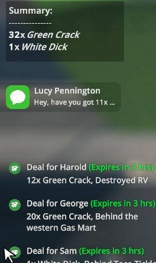

# ProductSum
> Summarize your deals.

Adds a summary of your deals - total amount at a glance.



## Installation
1. Install MelonLoader
2. Extract the zip file
3. Place the dll file into the Mods directory
4. Launch the game

Summary UI will appear when you accept at least 2 deals.

## Configuration
1. Open the config file in `UserData/MelonLoader.cfg`
2. Edit the config file to your liking
```ini
[ProductSum]
; AlwaysOn - if false, the UI will only show on key press. Normally, it will show when you have more than 1 deal.
AlwaysOn = true
; SplitByTimeSlot - if true, the UI will show a summary for each time slot. When false, it will show a summary for all time slots.
SplitByTimeSlot = true
; Keybind - the key to show the UI. Default is P.
Keybind = "P"
; Timeout - the time in seconds to show the UI when using the keybind. Default is 5.
Timeout = 5
```

